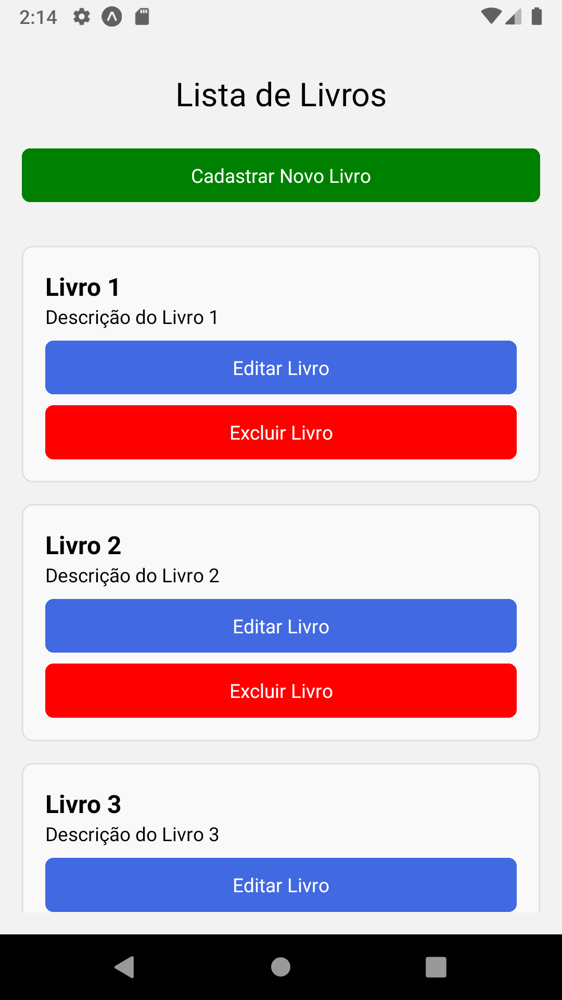
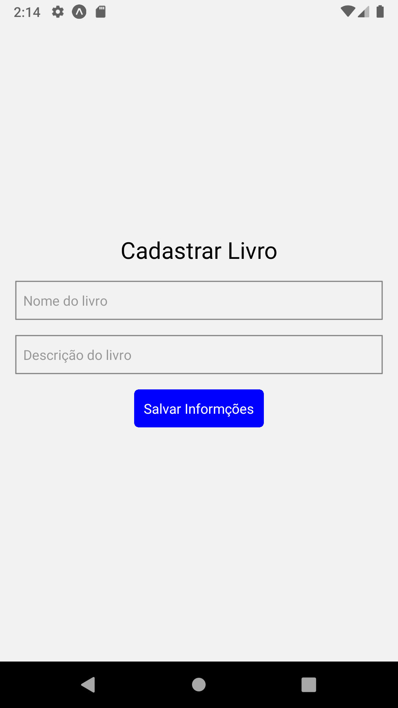
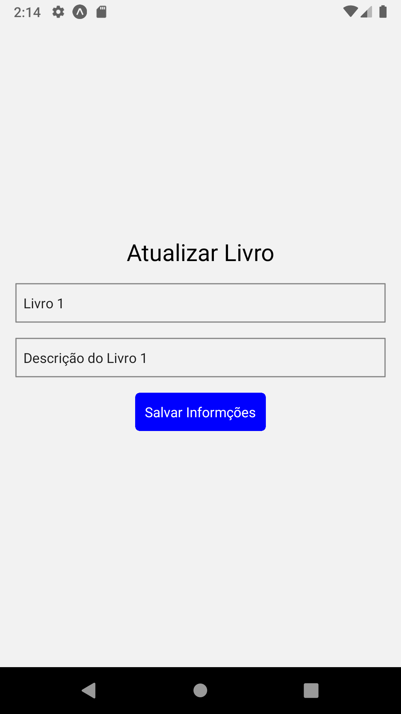
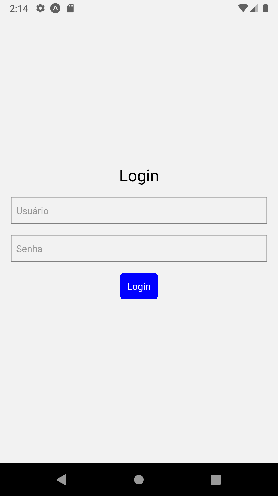

# Trabalho II - Desenvolvimento de Software para Dispositivos Móveis

## Descrição 
O aplicativo desenvolvido no trabalho é um app com login de usuário fixo no qual o usuário logado poderá ver, cadastrar, editar e excluir livros. O login fixo é feito com as seguintes credenciais:
usuário: usuario123, senha: senha123, caso sejam utilizadas outras credencias o app emite um alerta informando que elas são inválidas.

## Telas da Aplicação:

  &nbsp;&nbsp;&nbsp;&nbsp;&nbsp;&nbsp;&nbsp;&nbsp;&nbsp;
  &nbsp;&nbsp;&nbsp;&nbsp;&nbsp;&nbsp;&nbsp;&nbsp;&nbsp;
  &nbsp;&nbsp;&nbsp;&nbsp;&nbsp;&nbsp;&nbsp;&nbsp;&nbsp;
  &nbsp;&nbsp;&nbsp;&nbsp;&nbsp;&nbsp;&nbsp;&nbsp;&nbsp;

## Funcionalidades: 
- Login com usuário fixo
- Listagem de Livros
- Cadastro de livro
- Atualização de livro
- Remoção de livro

## Ferramentas utilizadas:
- React Navigation
- Layout Flex
- Context API
- Redux
